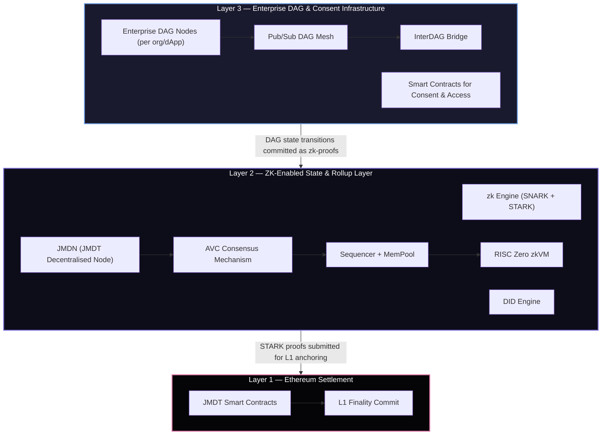

# Architecture

> JMDT is a multi-layered blockchain infrastructure designed to support **scalable, privacy-preserving**, and **enterprise-grade data processing** — from user consent to Ethereum finality.

The architecture is divided into three core layers: **L3** (enterprise DAGs), **L2** (zkRollup + AVC consensus), and **L1** (Ethereum anchoring).

## Architecture Overview

---

## Layer 3 — Enterprise DAG & Consent Infrastructure

Layer 3 is the enterprise data layer. Each organisation or dApp (e.g., SuperJ, Hercules, finance, healthcare) deploys a **private DAG (Directed Acyclic Graph) node** for high-throughput, localised operations.

### Enterprise DAG Nodes

- DAG nodes are synchronised internally using **RAFT consensus**, while state transitions are periodically committed to L2
- Supports **10,000+ TPS** for enterprise-scale data operations
- Each node is permissioned, independently scalable, and anchored to JMDT Layer 2 for rollup-based finality and zk-proof auditability

### Smart Contracts for Consent & Access

- Govern user onboarding, consent capture, and access rights for data exchange
- Only anonymised data is published to DAGs post-consent

### InterDAG Bridge

- Facilitates cross-enterprise collaboration using shared smart contracts
- Enables access requests, logging, and secure off-chain queries between DAG nodes

### Pub/Sub DAG Mesh

- Supports streaming analytics and real-time data ingestion via Pub/Sub architecture
- Every node builds **vertices and branches**, logged with persistent storage and synchronised using RAFT

---

## Layer 2 — ZK-Enabled State & Rollup Layer

Layer 2 is the core JMDT chain — where consensus is reached, identities are verified, and zk-proofs are generated and aggregated before Ethereum settlement.

### zk Engine (SNARK + STARK)

Verifies DAG transactions and batch validity using zero-knowledge proofs. JMDT supports both:
- **zk-SNARKs** — efficient, minimal proof size for transaction-level validation
- **zk-STARKs** — quantum-resistant, no trusted setup, for large-scale state aggregation

All ZK circuits are written in **Rust** and executed within the **RISC Zero zkVM**, providing deterministic, auditable guest programs that output STARK proofs submitted to Ethereum.

### DID Engine

Provides W3C-compliant Decentralised Identity, allowing private yet verifiable authentication across all L2 and L3 operations.

### AVC Consensus Mechanism

JMDT's **Asynchronous Validation Consensus (AVC)** combines:
- **VRF-based buddy selection** — deterministic, randomised validator sets each round
- **Asynchronous quorum validation** — no global timing required; parallel validation across all JMDN nodes
- **zk-proof enhanced verification** — each block includes a zk-proof verified independently by all buddies
- **Gossip-based propagation** — efficient dissemination of transactions, votes, and zk-proofs
- **CRDT-driven conflict resolution** — convergence guaranteed even under network partitions

See [AVC Consensus →](/docs/bft) for full details.

### Sequencer & MemPool

Aggregates DAG state transitions into zk-proofs using a modular zkVM. Manages transaction ordering, batching, and DAG-to-L2 relay.

### RISC Zero zkVM

Executes rollup verification logic as a deterministic, auditable guest program. Outputs STARK proofs submitted to Ethereum for L1 anchoring.

### JMDN — JMDT Decentralised Node

The **JMDT Decentralised Node (JMDN)** is the primary network node binary. All JMDN nodes participate in AVC consensus, propagate blocks and votes via the Gossip Protocol, and maintain the immudb-backed immutable ledger.

---

## Layer 1 — Ethereum Settlement Layer

Ethereum serves as the **foundational settlement layer** for JMDT, providing censorship-resistance, security, and global finality.

### JMDT Smart Contracts

- Receive L2 commitments, verify zkVM STARK proofs, and finalise state on Ethereum
- Audited by independent firms prior to mainnet deployment
- Open-sourced for full transparency

### L1 Finality Commit

- Ensures integrity and auditability of enterprise and validator activity
- Supports transparent public settlement while preserving L3 data privacy
- All L2 transactions committed to Ethereum dynamically based on optimal gas fees and block time

---

## Key Properties

| Property | Description |
|---|---|
| **Privacy-Preserving** | DID verification, ZK proof data validation — personal data is verified without being shared |
| **Enterprise-First** | L3 DAG Mesh Network allows private computation, internal tokenisation, and industry-specific logic |
| **Verifiable Rollups** | RISC Zero zkRollups provide immutable, trust-minimised proofs of all activity |
| **Scalable** | L2: 2,000+ TPS; L3 DAG: 10,000+ TPS; ~3–10s L2 finality |
| **Composable** | Every layer is independently upgradeable and EVM-compatible |

---

## Trust Model

| Layer | Trust Model | Threats Mitigated |
|---|---|---|
| **L1 (Ethereum)** | Ethereum finality and censorship-resistance | Network reorgs, malicious smart contracts |
| **L2 (JMDT Chain)** | ≥ 2/3 honest, randomised validators in AVC | Sybil attacks, block manipulation, equivocation |
| **L3 (Enterprise DAG)** | Internal integrity within enterprise | Insider tampering, unauthorised data access |
| **ZK Proof System** | Soundness of zkSNARK/zkSTARK cryptographic assumptions | Proof forgery, data leakage |
| **RISC Zero zkVM** | Deterministic Rust guest execution | Non-determinism, circuit manipulation |
