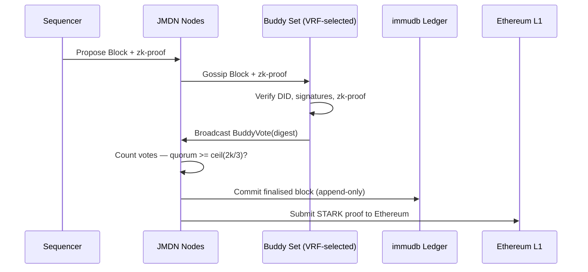

# AVC Consensus Mechanism

> **JMDT — The Truth Layer for Verifiable Information.** To achieve fast, tamper-resistant, and scalable block finality in the JMDT Layer 2 blockchain, we implement **Asynchronous Validation Consensus (AVC)** — a quorum-based, non-synchronous consensus model designed for decentralised environments and strengthened with zk-proof guarantees.

Unlike producer-driven consensus models, AVC relies on **collective validation by randomised buddy sets**, ensuring fairness, resilience, and transparency. JMDN nodes independently verify proposed blocks, align on Merkle digests, and reach quorum **without relying on fixed committees or synchronous rounds**.

---

## Key Components

### 1. Asynchronous Validation

When the Sequencer proposes a block, **all JMDN (JMDT Decentralised Node) nodes immediately enter validation mode**. This event-driven, non-blocking design allows **parallel validation** across the network without reliance on global timing or designated leaders.

### 2. VRF-Based Buddy Node Selection

A **Verifiable Random Function (VRF)-based Buddy Node Selection Algorithm**, weighted by Seed Node feedback, deterministically selects a buddy set of *k* nodes each round.

- Ensures **fairness, geo-diversity, and resistance to Sybil or cartel attacks**
- Buddies perform: signature and DID checks, balance sufficiency and ownership validation, and zk-proof verification for batch integrity
- A block is accepted when **≥ q_buddy = ⌈2k/3⌉ buddies** sign and broadcast a `BuddyVote(digest)`
- This threshold guarantees overlap between quorums and resilience against Byzantine behaviour

### 3. zk-Proof Integrity

Each block must include a **zk-proof** (generated off-chain by the RISC Zero zkVM or a prover service):

- zk-proofs validate batched execution correctness and are verified independently by all buddies
- Ensures **privacy-preserving validation** without exposing internal state transitions
- Proofs are generated using Rust-based circuits compiled to zkVM-executable guest binaries

### 4. Gossip Protocol

A decentralised backbone for **disseminating transactions, buddy votes, and zk-proofs** efficiently across the JMDN network:

- **Bloom Filters** prevent duplicate or replayed messages, reducing bandwidth overhead
- Enables low-latency, fault-tolerant propagation of consensus-critical data across all peers

### 5. CRDT-Based Conflict Resolution

If buddy digests diverge, **Conflict-Free Replicated Data Type (CRDT)-based reconciliation** merges results to achieve eventual consistency:

- A temporary scoped leader may coordinate the merge, but no permanent authority exists
- Guarantees convergence even under network partitions
- Used for votes, digests, and mempool views across buddy and network states

### 6. Immutable Ledger via immudb

Finalised blocks are committed to **immudb**, ensuring:
- **Append-only, tamper-proof history**
- **Auditability** for enterprise use cases
- Separate storage of flagged or invalid transactions for accountability

---

## Consensus Flow



---

## Security & Operational Benefits

| Feature | Benefit |
|---|---|
| **zk-proof validation** | Privacy-preserving and verifiable transaction proofs |
| **VRF + quorum** | Randomised, fair buddy sets; strong Byzantine fault tolerance |
| **Gossip + Bloom Filters** | Efficient, low-latency peer-to-peer communication |
| **CRDT-based reconciliation** | Convergent state even under partitions |
| **Incentive alignment** | Sequencer rewarded only after quorum validation succeeds |
| **Adaptive weighting** | Seed Nodes penalise malicious nodes and reward honest ones |

---

## Why AVC Matters

The AVC protocol ensures that block finality in JMDT is:

- **Verifiable** — through zk-proofs on every block
- **Decentralised** — randomised buddy-set validation; no fixed validators
- **Responsive** — asynchronous quorum, no global coordination (~3–10s finality)
- **Audit-ready** — immudb-backed append-only history
- **Adaptive** — dynamic Seed Node weight updates favour reliable nodes

This design also forms the foundation for **Layer 3 DAG extensions** and enterprise-specific consensus frameworks, making AVC a **future-proof consensus model** for data-driven blockchain applications.

---

## Implementation Reference

The AVC module lives at `JMDN/AVC/` in the node codebase:

```
JMDN/AVC/
├── BFT/              # BuddyVote PREPARE/COMMIT phases, Byzantine fault detection
├── BLS/              # BLS signature generation, aggregation, and verification
├── BuddyNodes/       # Buddy node selection, CRDT sync, message passing
│   ├── MessagePassing/
│   ├── CRDTSync/
│   └── ServiceLayer/
├── NodeSelection/    # VRF-based buddy selection (pkg/selection/vrf.go)
└── VoteModule/       # Vote validation and aggregation
```

**Key configuration constants** (`config/constants.go`):
- `MaxMainPeers` — Maximum main buddy nodes (default: 13)
- `MaxBackupPeers` — Maximum backup buddy nodes (default: 10)
- `ConsensusTimeout` — Timeout for consensus operations (default: 20s)

See [JMDN Node →](/docs/jmdt-node) and [Sequencer →](/docs/sequencer) for integration details.
