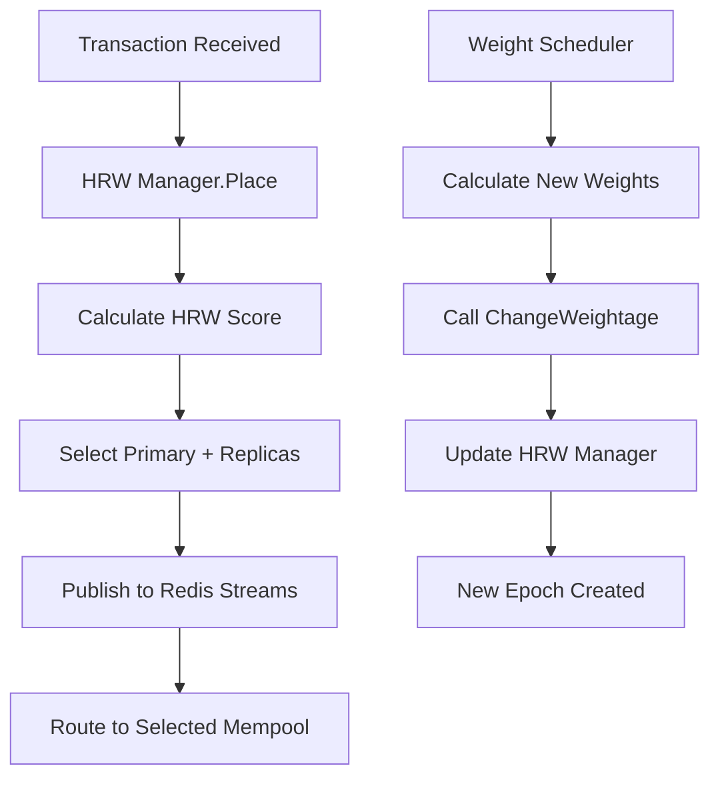

# Mempool Routing Engine (MRE)

A high-performance control plane for decentralized mempool networks. The MRE provides deterministic transaction placement, replication, consensus, and retrieval across independent mempool nodes with high availability, fault tolerance, and low latency.

## 🆕 Latest Updates

### 🚀 **Modern HRW Integration (v2.0)**
- ✅ **HRW Manager**: Complete epoch-based HRW Manager with Redis Streams integration
- ✅ **Dynamic Weight Updates**: Automatic HRW weight updates via `ChangeWeightage()` function
- ✅ **Redis Streams Publishing**: Real-time transaction placement publishing to Redis Streams
- ✅ **Epoch-based Configuration**: Historical transaction stability with dynamic weight updates
- ✅ **Multi-format NodeID Support**: Flexible NodeID to ShardID conversion for various naming patterns
- ✅ **Weight Scheduler Integration**: Automatic HRW Manager updates when new weights are calculated
- ✅ **Reflection-based Integration**: Seamless HRW Manager integration without circular imports

### 🔧 **Enhanced Features**
- ✅ **HRW - Weights Algorithm**: Advanced weighted selection based on system metrics, mempool capacity, and fee affordability
- ✅ **High Throughput Testing**: Enhanced test clients supporting 1000+ transactions per second
- ✅ **Real-time Metrics**: Redis integration for live system and mempool metrics
- ✅ **Latency-aware Routing**: Network latency measurement and exclusion of unreachable mempools
- ✅ **Weight Scheduler**: Background process for periodic weight updates (configurable interval)
- ✅ **Enhanced Go Client**: Multi-worker concurrent transaction testing with real-time statistics
- ✅ **Python Test Clients**: Alternative test clients with async support and batch processing
- ✅ **Flexible Server URLs**: Command-line URL arguments for testing different environments
- ✅ **Integrated MRE Binary**: Single executable with all modules integrated
- ✅ **Run-All Command**: Start all modules simultaneously with one command
- ✅ **JSON Configuration**: Mempool addresses configurable via JSON file
- ✅ **Redis Integration**: Real-time log storage and analytics with Redis
- ✅ **Logging Server**: Dedicated NATS consumer with Redis persistence
- ✅ **Unified CLI**: Single MRE binary with server, logging, and run-all subcommands
- ✅ **Docker Support**: Redis container setup and testing
- ✅ **Comprehensive Testing**: Full client-server integration tests

## 🏗️ Architecture Overview

The Mempool Routing Engine acts as a smart proxy between JMDT (JMDT) nodes and actual mempool servers, providing:

- **Transaction Validation**: Comprehensive Ethereum transaction format validation
- **Modern HRW Manager**: Epoch-based HRW Manager with Redis Streams integration for intelligent routing
- **Dynamic Weight Updates**: Automatic weight updates via `ChangeWeightage()` when new weights are calculated
- **Redis Streams Publishing**: Real-time transaction placement decisions published to Redis Streams
- **Intelligent Routing**: Deterministic placement across multiple mempool nodes with HRW weights algorithm
- **HRW Weights Algorithm**: Advanced weighted selection based on system metrics, mempool capacity, and fee affordability
- **Centralized Logging**: NATS JetStream-based log aggregation and routing
- **Redis Persistence**: Real-time log storage and analytics with Redis
- **High Availability**: Fault-tolerant design with automatic failover
- **Real-time Monitoring**: Comprehensive metrics and health checks

### System Architecture

```
┌─────────────────┐    ┌─────────────────┐    ┌─────────────────┐
│   JMDT Node-1   │    │   JMDT Node-2   │    │   JMDT Node-N   │
│                 │    │                 │    │                 │
└─────────┬───────┘    └─────────┬───────┘    └─────────┬───────┘
          │                      │                      │
          │     gRPC (Port 8080) │                      │
          └──────────────────────┼──────────────────────┘
                                 ▼
                    ┌─────────────────────────┐
                    │  Mempool Routing Engine │
                    │    (gRPC Server)        │
                    │     localhost:8080      │
                    └─────────┬───────────────┘
                              │
                    ┌─────────▼───────────────┐
                    │   Mempool Servers       │
                    │ 192.168.100.40:16002    │
                    └─────────┬───────────────┘
                              │
                    ┌─────────▼───────────────┐
                    │    NATS JetStream       │
                    │    localhost:4222       │
                    │                         │
                    │ • mempool_system_metrics│
                    │ • mempool_mempool_metrics│
                    │ • mempool_application_logs│
                    └─────────┬───────────────┘
                              │
                    ┌─────────▼───────────────┐
                    │   Logging Server        │
                    │   (NATS Consumer)       │
                    │   localhost:6379        │
                    └─────────┬───────────────┘
                              │
                    ┌─────────▼───────────────┐
                    │      Redis              │
                    │   (Log Storage)         │
                    │   localhost:6379        │
                    └─────────────────────────┘
```

## 🚀 Quick Start

### Prerequisites

- Go 1.22+
- NATS Server
- Redis Server
- Docker (for Redis container)
- buf (for protobuf generation)

### 🚀 Quick Start Command

**Start all services with one command:**

```bash
# Build the MRE binary
go build -o MRE .

# Set up mempool configuration (first time only)
cp mempoolAddress.example.json mempoolAddress.json

# Start all modules simultaneously (RECOMMENDED)
./MRE run-all -server-port=8080 -stream=all

# Alternative: Start with custom settings
./MRE run-all -server-port=8080 -stream=all -nats-url=nats://localhost:4222 -redis=localhost:6379 -config=custom-mempools.json

# Use custom mempool configuration
./MRE run-all -config=custom-mempools.json -server-port=8080
```

**What this does:**
- ✅ Starts gRPC server on port 8080
- ✅ Starts logging server with all streams
- ✅ Connects to NATS and Redis
- ✅ Loads mempool configurations from `mempoolAddress.json`
- ✅ Initializes all configured mempool connections
- ✅ Ready to handle transactions immediately

### 📋 Mempool Configuration

The MRE uses a JSON configuration file to manage mempool server connections. This makes it easy to add, remove, or modify mempool servers without changing code.

#### **Default Configuration File: `mempoolAddress.json`**

```json
{
  "mempools": [
    {
      "nodeID": "Mempool-1",
      "address": "192.168.100.40:16002",
      "description": "Local mempool server"
    },
    {
      "nodeID": "Mempool-2", 
      "address": "34.35.105.162:16003",
      "description": "GCP mempool server 2"
    },
    {
      "nodeID": "Mempool-3",
      "address": "34.32.109.236:16003", 
      "description": "GCP mempool server 3"
    },
    {
      "nodeID": "Mempool-4",
      "address": "34.96.183.179:16003",
      "description": "GCP mempool server 4"
    },
    {
      "nodeID": "Mempool-5",
      "address": "34.174.191.157:16003",
      "description": "GCP mempool server 5"
    },
    {
      "nodeID": "Mempool-6",
      "address": "0.0.0.0:50051",
      "description": "Sai mempool server 6"
    }
  ]
}
```

#### **Setting Up Configuration**

```bash
# Copy the example configuration file
cp mempoolAddress.example.json mempoolAddress.json

# Edit the configuration file with your mempool addresses
nano mempoolAddress.json
# or
vim mempoolAddress.json
```

#### **Using Custom Configuration**

```bash
# Use default configuration
./MRE server -port=8080

# Use custom configuration file
./MRE server -config=production-mempools.json -port=8080

# Use custom configuration with run-all
./MRE run-all -config=dev-mempools.json -server-port=8080
```

#### **Configuration Benefits**

- 🔧 **Easy Management**: Add/remove mempools without code changes
- 🌍 **Environment Specific**: Different configs for dev/staging/prod
- 📝 **Descriptive**: Each mempool has a description field
- 🔄 **Hot Swappable**: Change configs without rebuilding
- 📊 **Better Logging**: Shows which config file is loaded

### Installation

#### macOS

```bash
# Clone the repository
git clone <repository-url>
cd Mempool-Routing-Engine

# Install dependencies
go mod tidy
go mod download

# Install buf for protobuf generation
brew install bufbuild/buf/buf

# Install NATS server
brew install nats-server

# Install Redis (or use Docker)
brew install redis

# Install Docker (for Redis container)
# Download from https://www.docker.com/products/docker-desktop

# Install grpcurl for testing (optional)
brew install grpcurl
```

#### Linux (Ubuntu/Debian)

```bash
# Clone the repository
git clone <repository-url>
cd Mempool-Routing-Engine

# Install dependencies
go mod tidy
go mod download

# Install buf for protobuf generation
# Download from https://github.com/bufbuild/buf/releases
curl -sSL "https://github.com/bufbuild/buf/releases/latest/download/buf-$(uname -s)-$(uname -m)" -o "/usr/local/bin/buf"
chmod +x "/usr/local/bin/buf"

# Install NATS server
curl -L https://github.com/nats-io/nats-server/releases/download/v2.11.8/nats-server-v2.11.8-arm64.deb -o nats-server.zip
unzip nats-server.zip
sudo mv nats-server-v2.10.0-linux-amd64/nats-server /usr/local/bin/
rm -rf nats-server.zip nats-server-v2.10.0-linux-amd64

# Install Redis
sudo apt update
sudo apt install redis-server

# Install Docker
curl -fsSL https://get.docker.com -o get-docker.sh
sudo sh get-docker.sh
sudo usermod -aG docker $USER

# Install grpcurl for testing (optional)
go install github.com/fullstorydev/grpcurl/cmd/grpcurl@latest
```

#### Linux (CentOS/RHEL/Fedora)

```bash
# Clone the repository
git clone <repository-url>
cd Mempool-Routing-Engine

# Install dependencies
go mod tidy
go mod download

# Install buf for protobuf generation
# Download from https://github.com/bufbuild/buf/releases
curl -sSL "https://github.com/bufbuild/buf/releases/latest/download/buf-$(uname -s)-$(uname -m)" -o "/usr/local/bin/buf"
chmod +x "/usr/local/bin/buf"

# Install NATS server
curl -L https://github.com/nats-io/nats-server/releases/latest/download/nats-server-v2.10.0-linux-amd64.zip -o nats-server.zip
unzip nats-server.zip
sudo mv nats-server-v2.10.0-linux-amd64/nats-server /usr/local/bin/
rm -rf nats-server.zip nats-server-v2.10.0-linux-amd64

# Install Redis
# For CentOS/RHEL:
sudo yum install epel-release
sudo yum install redis

# For Fedora:
sudo dnf install redis

# Install Docker
curl -fsSL https://get.docker.com -o get-docker.sh
sudo sh get-docker.sh
sudo usermod -aG docker $USER

# Install grpcurl for testing (optional)
go install github.com/fullstorydev/grpcurl/cmd/grpcurl@latest
```

#### Windows

```powershell
# Clone the repository
git clone <repository-url>
cd Mempool-Routing-Engine

# Install dependencies
go mod tidy
go mod download

# Install buf for protobuf generation
# Download from https://github.com/bufbuild/buf/releases
# Extract buf.exe to a directory in your PATH

# Install NATS server
# Download from https://github.com/nats-io/nats-server/releases
# Extract nats-server.exe to a directory in your PATH

# Install Redis
# Option 1: Using Chocolatey
choco install redis-64

# Option 2: Using Scoop
scoop install redis

# Option 3: Download from https://github.com/microsoftarchive/redis/releases

# Install Docker Desktop
# Download from https://www.docker.com/products/docker-desktop

# Install grpcurl for testing (optional)
go install github.com/fullstorydev/grpcurl/cmd/grpcurl@latest
```

### Build and Run

```bash
# Generate protobuf code
buf generate

# Build the integrated MRE binary
make build

# Or build directly
go build -o MRE .

# Build test client separately
go build -o bin/test-client ./Tests
```

### Start the System

#### All Platforms

```bash
# 1. Start Redis (using Docker)
docker run -d --name mempool-redis -p 6379:6379 redis:7-alpine

# 2. Start NATS JetStream server
# macOS/Linux:
nats-server -c ./nats-server.conf &

# Windows (PowerShell):
Start-Process -NoNewWindow nats-server -ArgumentList "-c", "./nats-server.conf"

# 3. Set up JetStream streams
# macOS/Linux:
./scripts/setup-streams.sh

# Windows (PowerShell):
.\scripts\setup-streams.sh

# 4. Start the system (choose one method)

# Method A: Run all modules simultaneously (RECOMMENDED)
./MRE run-all

# Method B: Run modules separately
# Terminal 1 - Start the server:
./MRE server -port=8080

# Terminal 2 - Start the logging server:
./MRE loggingServer -stream=all

# Method C: Using Makefile
make run-all

# 5. Test the system
# macOS/Linux:
./bin/test-client

# Windows:
.\bin\test-client.exe
```

#### Platform-Specific Notes

**macOS/Linux:**
- Use `&` to run processes in background
- Use `./` prefix for executable files
- Use forward slashes `/` for paths

**Windows:**
- Use `Start-Process` for background processes
- Use `.\` prefix for executable files
- Use backslashes `\` for paths
- Ensure PowerShell execution policy allows scripts: `Set-ExecutionPolicy -ExecutionPolicy RemoteSigned -Scope CurrentUser`

### Command-Line Options

The MRE binary supports multiple subcommands:

```bash
# Show help message
./MRE help

# Start routing engine server
./MRE server -port=8080

# Start server with custom mempool configuration
./MRE server -config=custom-mempools.json -port=8080

# Start logging server with Redis
./MRE loggingServer -stream=all -redis=localhost:6379

# Run all modules simultaneously (RECOMMENDED)
./MRE run-all

# Run all modules with custom configuration
./MRE run-all -config=production-mempools.json -server-port=8080

# Show help for specific commands
./MRE server -help
./MRE loggingServer -help
./MRE run-all -help
```

#### Available Subcommands:

**`server`** - Start the gRPC routing engine server
- `-port`: Port to listen on (default: 8080)
- `-config`: Path to mempool configuration JSON file (default: mempoolAddress.json)
- `-weight-interval`: Weight update interval (default: 5m)
- `-help`: Show server help message

**`loggingServer`** - Start the logging server for real-time log monitoring
- `-url`: NATS server URL (default: nats://localhost:4222)
- `-stream`: Stream type to consume (all, system, mempool, app)
- `-redis`: Redis server URL (default: localhost:6379)
- `-redis-password`: Redis password (default: empty)
- `-redis-db`: Redis database number (default: 0)

**`run-all`** - Start both server and logging server simultaneously
- `-server-port`: Port for the gRPC server (default: 8080)
- `-config`: Path to mempool configuration JSON file (default: mempoolAddress.json)
- `-weight-interval`: Weight update interval (default: 5m)
- `-stream`: Stream type for logging server (default: all)
- `-nats-url`: NATS server URL (default: nats://localhost:4222)
- `-redis`: Redis server URL (default: localhost:6379)
- `-redis-password`: Redis password (default: empty)
- `-redis-db`: Redis database number (default: 0)

**`test-weights`** - Test the HRW weights algorithm with real-time metrics
- `-redis`: Redis server URL for real-time metrics (optional)
- Demonstrates weight calculation with live system and mempool data
- Tests HRW Manager integration with dynamic weight updates
- Validates NodeID to ShardID conversion for various formats

## 🚀 Running All Modules

### Quick Start with `run-all`

The easiest way to start the entire MRE system is using the `run-all` command:

```bash
# Start all modules with default settings
./MRE run-all

# Start all modules with custom server port
./MRE run-all -server-port=9090

# Start all modules with custom mempool configuration
./MRE run-all -config=production-mempools.json -server-port=8080

# Start all modules with custom settings
./MRE run-all -server-port=9090 -stream=system -nats-url=nats://localhost:4222

# Test the HRW weights algorithm with HRW Manager
./MRE test-weights -redis localhost:6379
```

### Using Makefile

```bash
# Start all modules
make run-all

# Start all modules with custom server port
make run-all SERVER_PORT=9090
```

### What `run-all` Does

The `run-all` command starts both modules simultaneously:

1. **gRPC Server** - Handles transaction routing and validation
2. **Logging Server** - Consumes NATS streams and stores logs in Redis

Both modules run concurrently and can be stopped together with `Ctrl+C`.

### Running Modules Separately

If you prefer to run modules in separate terminals:

```bash
# Terminal 1 - Start the server
./MRE server -port=8080

# Terminal 1 - Start the server with custom config
./MRE server -config=custom-mempools.json -port=8080

# Terminal 2 - Start the logging server
./MRE loggingServer -stream=all
```

## 🧪 Testing

### High Throughput Testing

The MRE includes comprehensive high throughput testing capabilities to validate performance under load:

#### **Enhanced Go Test Client**

The enhanced `transaction_client.go` now supports high throughput testing with multiple worker goroutines:

```bash
# High throughput test - 1000 tx/sec for 60 seconds with 10 workers
go run transaction_client.go -high-throughput -rate=1000 -duration=60 -workers=10

# Stress test - 2000 tx/sec for 30 seconds
go run transaction_client.go -high-throughput -rate=2000 -duration=30 -workers=20

# Custom server URL
go run transaction_client.go -high-throughput -server=34.174.63.179:8080 -rate=500 -duration=30

# Batch testing
go run transaction_client.go -batch -batch-count=10 -batch-size=100

# Traditional testing (still available)
go run transaction_client.go -count=50 -delay=500ms
```

#### **Python Test Clients**

Alternative Python clients provide additional testing flexibility:

```bash
# High throughput Python client (gRPC)
python3 high_throughput_client.py --mode throughput --rate=1000 --duration=60 --workers=10

# Simple Python client (gRPC)
python3 simple_python_client.py --mode throughput --rate=1000 --duration=60 --workers=10

# HTTP-based client (no gRPC dependencies)
python3 simple_http_client.py --mode throughput --rate=1000 --duration=60 --workers=10

# Batch testing
python3 high_throughput_client.py --mode batch --batch-size=100 --batches=10

# Custom server URL
python3 high_throughput_client.py --server=34.174.63.179:8080 --mode throughput --rate=500
```

**Python Client Options:**
- **`high_throughput_client.py`**: Full-featured async client with advanced statistics
- **`simple_python_client.py`**: Basic gRPC client for simple testing
- **`simple_http_client.py`**: HTTP-based client (bypasses gRPC compilation)

See [Tests/PYTHON_README.md](Tests/PYTHON_README.md) for detailed Python client documentation.

#### **Unified Test Runner**

Use the shell script for easy testing with different configurations:

```bash
# Quick start - default high throughput test
./run_python_tests.sh

# Custom rate and duration
./run_python_tests.sh throughput --rate=500 --duration=30 --workers=5

# Different server
./run_python_tests.sh --url=localhost:8080 throughput --rate=1000

# Batch testing
./run_python_tests.sh batch --batch-size=50 --batches=20

# Stress test
./run_python_tests.sh stress

# Run all tests
./run_python_tests.sh all
```

#### **Test Features**

- **🚀 High Performance**: Support for 1000+ transactions per second
- **👥 Concurrent Workers**: Multiple worker threads/goroutines for parallel processing
- **📊 Real-time Statistics**: Live success/failure rates and performance metrics
- **🎯 Configurable Parameters**: Rate, duration, workers, batch size, server URL
- **🔄 Multiple Test Modes**: Throughput, batch, stress testing
- **📈 Performance Monitoring**: Rate efficiency, success rates, duration tracking
- **🌐 Flexible Server URLs**: Test against different MRE instances

#### **Performance Expectations**

| Test Type | Rate | Duration | Workers | Expected Success Rate |
|-----------|------|----------|---------|----------------------|
| **Throughput** | 1000 tx/sec | 60s | 10 | 95%+ |
| **Stress** | 2000 tx/sec | 30s | 20 | 90%+ |
| **Batch** | 100 tx/batch | 10 batches | N/A | 98%+ |

### Redis Integration Testing

#### Using Docker (All Platforms)

```bash
# Check Redis connection
docker exec -it mempool-redis redis-cli ping

# View all stored logs
docker exec -it mempool-redis redis-cli keys "*"

# Get latest system metrics
docker exec -it mempool-redis redis-cli hgetall "mempool:logs:system:metrics:mempool-clean-01"

# View recent log entries
docker exec -it mempool-redis redis-cli lrange "mempool:logs:system:list" 0 -1

# Get specific log entry
docker exec -it mempool-redis redis-cli get "mempool:logs:system:mempool-clean-01:1757000902710939000"
```

#### Using Local Redis Installation

**macOS/Linux:**
```bash
# Check Redis connection
redis-cli ping

# View all stored logs
redis-cli keys "*"

# Get latest system metrics
redis-cli hgetall "mempool:logs:system:metrics:mempool-clean-01"

# View recent log entries
redis-cli lrange "mempool:logs:system:list" 0 -1
```

**Windows:**
```powershell
# Check Redis connection
redis-cli ping

# View all stored logs
redis-cli keys "*"

# Get latest system metrics
redis-cli hgetall "mempool:logs:system:metrics:mempool-clean-01"

# View recent log entries
redis-cli lrange "mempool:logs:system:list" 0 -1
```

### Test with grpcurl

```bash
# List available services
grpcurl -plaintext localhost:8080 list

# Test GetTransaction
grpcurl -plaintext -d '{"hash": "0x123..."}' localhost:8080 proto.MempoolService.GetTransaction

# Test OnReceiveFromJMDT with valid transaction
grpcurl -plaintext -d '{
  "nodeId": "JMDT-Node-001",
  "singleTransaction": {
    "hash": "0x1234567890abcdef1234567890abcdef1234567890abcdef1234567890abcdef",
    "from": "0xF39fd6e51aad88F6F4ce6aB8827279cffFb92266",
    "to": "0x8ba1f109551bD432803012645Ac136ddd64DBA72",
    "value": "10000000000000000",
    "type": "EIP-1559",
    "timestamp": "2025-09-03T08:45:32Z",
    "chainId": "11155111",
    "nonce": "42",
    "gasLimit": "21000",
    "maxFee": "25000000000",
    "maxPriorityFee": "2000000000",
    "data": "0x",
    "v": "0x1",
    "r": "0x2",
    "s": "0x3"
  },
  "timestamp": "2025-09-03T08:45:32Z"
}' localhost:8080 proto.MempoolService.OnReceiveFromJMDT
```

### Test Results

✅ **Valid Transaction**: Successfully processed and forwarded to mempool
✅ **Invalid Transaction**: Properly rejected with validation errors
✅ **Batch Processing**: Handles multiple transactions efficiently
✅ **Redis Integration**: Logs successfully stored and retrievable
✅ **NATS Consumer**: Real-time log processing working
✅ **Multi-Command CLI**: All subcommands functional
✅ **HRW Weights Algorithm**: Advanced weighted selection working correctly

## 📡 API Reference

### gRPC Service Methods

| Method | Description | Status |
|--------|-------------|---------|
| `OnReceiveFromJMDT` | Main method for receiving transactions from JMDT nodes | ✅ Implemented |
| `GetTransaction` | Retrieve a specific transaction by hash | ✅ Implemented |
| `SubmitTransaction` | Submit a single transaction | ⚠️ Not implemented |
| `SubmitTransactions` | Submit multiple transactions | ⚠️ Not implemented |
| `GetPendingTransactions` | Get pending transactions | ⚠️ Not implemented |
| `GetMempoolStats` | Get mempool statistics | ⚠️ Not implemented |
| `GetFeeStatistics` | Get fee statistics | ⚠️ Not implemented |

### Transaction Validation

The routing engine validates transactions against these criteria:

- **Required Fields**: Hash, From, To, Value, Type, ChainId, Nonce, GasLimit
- **Format Validation**:
  - Hash: Must start with "0x" and be 66 characters
  - Addresses: Must start with "0x" and be 42 characters
- **Empty Field Detection**: Trims whitespace and rejects empty fields

## 🧮 HRW Weights Algorithm

The MRE includes an advanced **Highest Random Weight (HRW)** algorithm for intelligent mempool routing. This algorithm calculates dynamic weights for each mempool node based on real-time system metrics, mempool capacity, and fee affordability.

### 🎯 Algorithm Overview

The HRW weights algorithm provides:

- **Multi-factor Weighting**: Considers system health, mempool capacity, cache performance, and fee affordability
- **Real-time Metrics**: Live data from Redis for system and mempool performance
- **Latency-aware Routing**: Network latency measurement and exclusion of unreachable mempools
- **Dynamic Load Balancing**: Automatically adjusts weights based on real-time metrics
- **CPU Moving Average**: Smooths out CPU spikes for more stable weight calculations
- **Configurable Intervals**: Weight update frequency can be customized (default: 5 minutes)
- **Fee Affordability**: Optional transaction caps for cost-conscious routing
- **Resource Pressure Handling**: Inverted scoring for lower-is-better metrics
- **Strictly Positive Weights**: Ensures consistent hashing for HRW

### 📊 Weight Calculation Factors

The algorithm considers the following metrics:

#### **System Metrics**
- **CPU Usage**: Lower usage = higher weight (with moving average smoothing)
- **Memory Usage**: Lower usage = higher weight  
- **Disk Usage**: Lower usage = higher weight
- **Load Average**: Lower load = higher weight
- **Network Latency**: Lower latency = higher weight (unreachable mempools excluded)

#### **Mempool Metrics**
- **Hot Cache Size**: Available capacity vs. maximum capacity
- **Total Transactions**: Current load vs. maximum capacity
- **Cache Hit Rate**: Performance efficiency (higher = better)
- **Average Fee**: Affordability vs. target fee

#### **Transaction Caps (Optional)**
- **Max Fee**: Maximum fee the transaction can pay
- **Max Priority Fee**: Maximum priority fee for EIP-1559 transactions

### 🔧 Configuration Parameters

The algorithm uses configurable parameters for tuning:

```go
type WeightParams struct {
    // Normalization anchors
    MaxHotCache      float64 // e.g., 5,000
    MaxTotalTx       float64 // e.g., 100,000
    GoodCacheHitPct  float64 // e.g., 95%
    GoodLoadAvg      float64 // e.g., #vCPUs
    TargetAvgFeeWei  float64 // e.g., affordable fee target
    MinReliability   float64 // safety floor, e.g., 0.1

    // Blend weights (automatically normalized)
    WFreeCap         float64 // Free capacity weight (default: 0.30)
    WCacheHit        float64 // Cache hit rate weight (default: 0.15)
    WLowFee          float64 // Low fee weight (default: 0.20)
    WLowCPU          float64 // Low CPU weight (default: 0.12)
    WLowMem          float64 // Low memory weight (default: 0.10)
    WLowDisk         float64 // Low disk weight (default: 0.05)
    WLowLoad         float64 // Low load weight (default: 0.08)

    // Global congestion throttle
    SurgeFactor      float64 // 0..1, usually 1.0
}
```

### ⚙️ Weight Scheduler Configuration

The weight scheduler runs in the background and periodically updates mempool weights:

```bash
# Start with default 5-minute interval
./MRE run-all

# Start with custom weight update interval (e.g., 2 minutes)
./MRE run-all -weight-interval=2m

# Start server with custom weight interval
./MRE server -weight-interval=1m -port=8080
```

**Weight Scheduler Features:**
- **Background Process**: Runs concurrently with the main server
- **Configurable Interval**: Set update frequency via command-line argument
- **Real-time Metrics**: Fetches live data from Redis
- **Latency Measurement**: Measures network latency to each mempool
- **Automatic Exclusion**: Skips unreachable or high-latency mempools
- **Detailed Logging**: Comprehensive logs of weight calculations and routing decisions

### 🧪 Testing the Algorithm

Test the HRW weights algorithm with sample data:

```bash
# Test with default parameters and sample metrics
./MRE test-weights

# Test with real-time Redis metrics
./MRE test-weights -redis=localhost:6379
```

**Sample Output:**
```
🧮 HRW Weights Algorithm Test

📊 Sample Metrics:
  System Metrics:
    CPU Usage: 45.0%
    Memory Usage: 60.0%
    Disk Usage: 30.0%
    Load Average: 1.20

  Mempool Metrics:
    Hot Cache Size: 1200
    Total Transactions: 8500
    Cache Hit Rate: 92.0%
    Average Fee: 35000000000 Wei (35.0 Gwei)

  Transaction Caps:
    Max Fee: 50000000000 Wei (50.0 Gwei)
    Max Priority Fee: 20000000000 Wei (20.0 Gwei)

🎯 Calculated Weight: 0.633813

✅ HRW weights algorithm test completed successfully!
   This weight can be used for consistent hashing in mempool routing.
```

### 🔄 Integration with Routing

The calculated weights are used for:

1. **Consistent Hashing**: Deterministic mempool selection based on transaction hash
2. **Load Balancing**: Higher weight = higher probability of selection
3. **Performance Optimization**: Routes to best-performing mempools
4. **Cost Optimization**: Considers fee affordability when transaction caps are provided

### 📈 Performance Benefits

- **Intelligent Routing**: Routes transactions to optimal mempools
- **Load Distribution**: Prevents overloading of individual mempools
- **Cost Efficiency**: Considers fee affordability for cost-conscious routing
- **Real-time Adaptation**: Weights update based on current system state
- **Fault Tolerance**: Automatically reduces weight of unhealthy nodes

## 🚀 Modern HRW Manager Integration

The MRE now includes a **complete HRW Manager** with epoch-based configuration and Redis Streams integration for high-performance transaction routing.

### 🎯 HRW Manager Features

- **Epoch-based Configuration**: Historical transaction placements remain stable while allowing dynamic weight updates
- **Redis Streams Publishing**: Real-time transaction placement decisions published to Redis Streams
- **Dynamic Weight Updates**: Automatic weight updates via `ChangeWeightage()` when new weights are calculated
- **Multi-format NodeID Support**: Flexible NodeID to ShardID conversion for various naming patterns
- **Weight Scheduler Integration**: Automatic HRW Manager updates when new weights are calculated
- **Reflection-based Integration**: Seamless HRW Manager integration without circular imports

### 🔄 HRW Manager Workflow



### 📊 HRW Manager Configuration

The HRW Manager is automatically initialized with mempool nodes:

```go
// HRW Manager initialization
hrwManager, err := HRW.NewManager("localhost:6379") // Redis Streams address

// Configure shards based on connected mempools
config := HRW.Config{
    Epoch:    1,
    Replicas: 3, // Primary + 2 replicas
    Shards: []HRW.Shard{
        {ID: 1, Weight: 1.0, Enabled: true},
        {ID: 2, Weight: 1.0, Enabled: true},
        {ID: 3, Weight: 1.0, Enabled: true},
    },
}

err = hrwManager.UpdateFromConfig(config)
```

### 🔧 Dynamic Weight Updates

When the Weight Scheduler calculates new weights, they are automatically applied to the HRW Manager:

```go
// Weight Scheduler integration
func (ws *WeightScheduler) updateHRWManagerWeights(weights []MempoolWeight) {
    for _, weight := range weights {
        if weight.Error == nil {
            shardID := ws.nodeIDToShardID(weight.NodeID)
            normalizedWeight := ws.normalizeWeight(weight.Weight)
            
            // Call ChangeWeightage on HRW Manager
            err := ws.callChangeWeightage(currentEpoch, shardID, normalizedWeight)
        }
    }
}
```

### 🎯 NodeID to ShardID Conversion

The system supports various NodeID formats:

- **Pure Numbers**: `"1"` → shard ID `1`
- **Hyphen-separated**: `"mempool-1"` → shard ID `1`
- **Embedded numbers**: `"mempool1"` → shard ID `1`
- **Hash-based fallback**: `"custom-node-abc"` → consistent hash-based shard ID

### 📡 Redis Streams Integration

Every transaction placement is automatically published to Redis Streams:

```json
{
  "QueryID": "tx_0x123...",
  "UserID": "system",
  "LookupType": "tx_placement",
  "Fields": {
    "tx_hash": "0x123...",
    "epoch": "2",
    "primary": "1",
    "replicas": "2,3"
  },
  "Timestamp": "2025-01-21T12:00:00Z",
  "Result": {
    "Epoch": 2,
    "Primary": 1,
    "Replicas": [2, 3],
    "All": [1, 2, 3]
  }
}
```

### 🧪 Testing HRW Manager

Test the complete HRW Manager integration:

```bash
# Test HRW weight calculation with Redis
./mre test-weights -redis localhost:6379

# Start server with HRW Manager
./mre server -port 8080 -redis localhost:6379

# Start all modules with HRW Manager
./mre all -server-port 8080 -redis localhost:6379
```

### 📈 HRW Manager Benefits

- **Epoch Stability**: Historical transactions maintain their placement
- **Dynamic Updates**: New transactions use updated weights
- **Real-time Publishing**: All placement decisions are streamed to Redis
- **Flexible NodeID Support**: Works with any mempool naming convention
- **Automatic Integration**: No manual intervention required
- **High Performance**: Optimized for 400K+ transactions per second

## 🔧 Configuration

### Server Configuration (`config.yml`)

```yaml
# Application Configuration
app:
  name: "MRE"
  environment: "development"
  version: "1.0.0"

# Network Configuration
network:
  defaultport: 7000
  targetPort: 15051
  protocol: "TCP"
  maxNodeConnections: 15

# NATS JetStream Configuration
nats:
  port: 4222
  httpPort: 8222
  dataDir: "./nats-data"
  maxMemoryStore: "2GB"
  maxFileStore: "50GB"
  maxConnections: 5000
  maxPayload: "10MB"
```

### Mempool Server Configuration

Update the mempool server addresses in `server/server.go`:

```go
mempoolConfigs := []struct {
    nodeID  string
    address string
}{
    {"Mempool-1", "192.168.100.40:16002"},
    {"Mempool-2", "192.168.1.101:8080"},
    {"Mempool-3", "10.0.0.50:8080"},
}
```

## 📊 Monitoring

### NATS JetStream Streams

- **`mempool_system_metrics`**: System performance metrics (7-day retention)
- **`mempool_mempool_metrics`**: Mempool-specific metrics (7-day retention)
- **`mempool_application_logs`**: Application logs and events (3-day retention)

### Redis Data Structure

The logging server stores data in Redis with the following structure:

```
# Individual log entries (with TTL: 24 hours)
mempool:logs:system:mempool-clean-01:1757000902710939000
mempool:logs:mempool:mempool-clean-01:1757000902710939001
mempool:logs:application:mempool-clean-01:1757000902710939002

# Time-series lists for recent logs
mempool:logs:system:list
mempool:logs:mempool:list
mempool:logs:application:list

# Structured metrics hashes (current state)
mempool:logs:system:metrics:mempool-clean-01
mempool:logs:mempool:metrics:mempool-clean-01
```

#### Sample Redis Commands:

```bash
# Get all keys
redis-cli keys "mempool:logs:*"

# Get latest system metrics
redis-cli hgetall "mempool:logs:system:metrics:mempool-clean-01"

# Get recent log entries
redis-cli lrange "mempool:logs:system:list" 0 9

# Get specific log entry
redis-cli get "mempool:logs:system:mempool-clean-01:1757000902710939000"
```

### Health Checks

```bash
# Check NATS server status
curl http://localhost:8222/varz

# Check gRPC server
grpcurl -plaintext localhost:8080 list

# Monitor streams
nats stream list --server=nats://localhost:4222
```

## 🛠️ Development

### Project Structure

```
Mempool-Routing-Engine/
├── internal/                  # Internal modules
│   ├── hrw/                  # HRW weights algorithm
│   │   └── weights.go        # Weight calculation implementation
│   └── redisconn/            # Redis connection utilities
├── logServer/                 # NATS consumer and Redis integration
│   ├── consumer.go           # NATS consumer implementation
│   └── redis.go              # Redis client and operations
├── proto/                     # Protobuf definitions
├── server/                    # gRPC server implementation
├── logger/                    # Logging utilities and NATS publisher
├── scripts/                   # Setup and utility scripts
├── Tests/                     # Test clients and utilities
├── config.yml                 # Application configuration
├── nats-server.conf          # NATS server configuration
├── main.go                   # Unified CLI with subcommands
└── Makefile                  # Build automation
```

### Available Make Targets

```bash
make help                    # Show all available targets
make build                   # Build integrated MRE binary
make run-server              # Start MRE server (use PORT=9090 for custom port)
make run-logging             # Start MRE logging server (use STREAM=system for specific stream)
make run-all                 # Start all MRE modules simultaneously (use SERVER_PORT=9090 for custom port)
make run-custom              # Run MRE with custom command (use CMD='server -port=9090')
make start-routing           # Start NATS routing engine
make setup-streams           # Create JetStream streams
make test                    # Run tests
make fmt                     # Format code
make lint                    # Lint code
```

### Integrated MRE Binary

The project now uses a single integrated MRE binary that contains all functionality:

```bash
# Build the integrated MRE binary
make build

# This creates:
# - MRE                     # Integrated MRE binary with all subcommands
# - bin/test-client         # Test client for integration testing

# Run all modules simultaneously
make run-all

# Run with custom port
make run-server PORT=9090
make run-all SERVER_PORT=9090

# Direct execution
./MRE run-all
./MRE server -port=8080
./MRE loggingServer -stream=all
```

### Adding New Features

1. **New gRPC Methods**: Add to `proto/mempool.proto` and regenerate
2. **New Validation Rules**: Update `isValidTransactionStruct()` in `main.go`
3. **New Routing Logic**: Modify `selectMempoolForTransaction()` in `main.go`
4. **New Subcommands**: Add to `getSubcommands()` in `main.go`
5. **New Streams**: Add to `scripts/setup-streams.sh`
6. **HRW Algorithm Tuning**: Modify `WeightParams` in `internal/hrw/weights.go`
7. **New Weight Factors**: Add new metrics to `SystemMetrics` or `MempoolMetrics`

## 🔒 Security Considerations

- **Authentication**: Currently uses insecure credentials (development only)
- **TLS**: Available for NATS communication (see TLS Setup section)
- **Input Validation**: Comprehensive transaction validation implemented
- **Rate Limiting**: Not implemented (consider adding)

## 🔐 TLS Certificate Setup

The MRE supports TLS encryption for secure NATS communication. Use the included certificate generation script to create production-ready certificates.

### Quick Start

```bash
# Generate certificates with auto-detected public IP
./scripts/generate-certs.sh

# Generate certificates for Google Cloud VM
./scripts/generate-certs.sh -p 34.123.45.67

# Show all available options
./scripts/generate-certs.sh --help
```

### Certificate Generation Options

| Option | Description | Default |
|--------|-------------|---------|
| `-p, --public-ip IP` | Public IP address to include in certificate | Auto-detect |
| `-d, --days DAYS` | Certificate validity in days | 365 |
| `-o, --output DIR` | Output directory for certificates | ./certs |
| `-c, --country CODE` | Country code | US |
| `-s, --state STATE` | State/Province | California |
| `-l, --city CITY` | City | San Francisco |
| `-n, --org ORG` | Organization | Mempool Routing Engine |
| `-u, --ou OU` | Organizational Unit | Protocol Team |
| `-e, --email EMAIL` | Email address | admin@mempool-routing.local |
| `-h, --help` | Show help message | - |

### Examples

```bash
# Auto-detect public IP (recommended)
./scripts/generate-certs.sh

# Specify public IP for cloud deployment
./scripts/generate-certs.sh -p 34.123.45.67

# Production setup with 2-year validity
./scripts/generate-certs.sh -p 34.123.45.67 -d 730 -o /etc/ssl/certs

# Custom organization details
./scripts/generate-certs.sh -p 34.123.45.67 -c "CA" -s "Ontario" -l "Toronto" -n "My Company" -u "IT Department" -e "admin@mycompany.com"
```

### Generated Certificates

The script creates the following certificate files:
- `ca.crt` - Certificate Authority certificate
- `server.crt` - Server certificate (includes public IP)
- `server.key` - Server private key
- `client.crt` - Client certificate
- `client.key` - Client private key

### Using TLS with MRE

```bash
# Start MRE with TLS-enabled NATS
./MRE run-all --nats-url=tls://localhost:4222 --nats-tls=true --nats-cert=./certs/client.crt --nats-key=./certs/client.key --nats-ca=./certs/ca.crt
```

For detailed TLS setup instructions, see [NATS_README.md](NATS_README.md).

## 🚀 Production Deployment

### Docker Support

```bash
# Build Docker image
make docker-build

# Run container
make docker-run
```

### GCP Deployment & vCPU Requirements

The MRE is designed for high-performance multi-threaded operation with parallel mempool server connections. Here are the recommended GCP instance configurations:

#### **Multi-Threading Architecture**
- **15 concurrent goroutines** per request (one per mempool server)
- **Parallel I/O operations** for maximum performance
- **Thread-safe data aggregation** across multiple servers
- **~15x faster** than sequential execution

#### **vCPU Requirements**

| Mempool Count | Minimum vCPUs | Recommended vCPUs | Memory | Use Case |
|---------------|---------------|-------------------|---------|----------|
| 5 mempools    | 4 vCPUs       | 6-8 vCPUs        | 16-32 GB | Development |
| 10 mempools   | 6 vCPUs       | 8-12 vCPUs       | 32-64 GB | Production |
| **15 mempools** | **8 vCPUs**   | **12-16 vCPUs**  | **64-128 GB** | **High-traffic Production** |

#### **GCP Instance Recommendations**

**Option 1: Cost-Optimized (Development)**
```bash
# e2-standard-4: 4 vCPUs, 16 GB RAM
gcloud compute instances create mempool-routing-dev \
  --machine-type=e2-standard-4 \
  --zone=us-central1-a \
  --image-family=ubuntu-2004-lts \
  --image-project=ubuntu-os-cloud \
  --boot-disk-size=50GB \
  --tags=http-server,https-server
```

**Option 2: Production (Recommended)**
```bash
# e2-standard-8: 8 vCPUs, 32 GB RAM
gcloud compute instances create mempool-routing-prod \
  --machine-type=e2-standard-8 \
  --zone=us-central1-a \
  --image-family=ubuntu-2004-lts \
  --image-project=ubuntu-os-cloud \
  --boot-disk-size=100GB \
  --tags=http-server,https-server
```

**Option 3: High-Performance (15+ Mempools)**
```bash
# e2-standard-16: 16 vCPUs, 64 GB RAM
gcloud compute instances create mempool-routing-hp \
  --machine-type=e2-standard-16 \
  --zone=us-central1-a \
  --image-family=ubuntu-2004-lts \
  --image-project=ubuntu-os-cloud \
  --boot-disk-size=200GB \
  --tags=http-server,https-server
```

#### **Auto-Scaling Configuration**

For production with variable load:

```bash
# Create instance template
gcloud compute instance-templates create mempool-routing-template \
  --machine-type=e2-standard-8 \
  --image-family=ubuntu-2004-lts \
  --image-project=ubuntu-os-cloud \
  --boot-disk-size=100GB \
  --tags=http-server,https-server

# Create managed instance group
gcloud compute instance-groups managed create mempool-routing-group \
  --template=mempool-routing-template \
  --size=2 \
  --zone=us-central1-a

# Configure auto-scaling
gcloud compute instance-groups managed set-autoscaling mempool-routing-group \
  --zone=us-central1-a \
  --max-num-replicas=8 \
  --min-num-replicas=2 \
  --target-cpu-utilization=0.7
```

#### **Performance Monitoring**

Key metrics to monitor:
- **CPU Usage**: Should stay below 70%
- **Memory Usage**: Should stay below 80%
- **Goroutine Count**: Monitor for goroutine leaks
- **Response Time**: Should be < 100ms for most requests
- **Connection Count**: Monitor mempool connection health

#### **Cost Optimization**

| Instance Type | vCPUs | Memory | Monthly Cost* | Use Case |
|---------------|-------|--------|---------------|----------|
| e2-standard-4 | 4 | 16 GB | $100-150 | Development |
| e2-standard-8 | 8 | 32 GB | $200-300 | Production |
| e2-standard-16 | 16 | 64 GB | $400-600 | High-traffic |
| Preemptible | 8 | 32 GB | $60-90 | Non-critical |

*Costs are approximate and vary by region and usage.

**Cost-saving tips:**
- Use **Preemptible Instances** for 60-80% savings (non-critical workloads)
- **Reserved Instances** for 30% savings (predictable workloads)
- **Committed Use Discounts** for up to 57% savings (1-3 year commitments)

#### **Network Requirements**

- **15 concurrent connections** to mempools
- **Incoming client connections** (gRPC on port 8080)
- **Bandwidth**: 1-10 Gbps depending on transaction volume
- **Firewall**: Allow inbound traffic on port 8080

```bash
# Create firewall rule
gcloud compute firewall-rules create allow-mempool-routing \
  --allow tcp:8080 \
  --source-ranges 0.0.0.0/0 \
  --description "Allow MRE gRPC traffic"
```

### Kubernetes Deployment

The `config.yml` includes Kubernetes-ready configuration for:
- Resource limits and requests
- Health checks (readiness/liveness probes)
- Auto-scaling configuration
- Volume mounts

### Environment Variables

```bash
# NATS Configuration
NATS_URL=nats://localhost:4222
NATS_HTTP_PORT=8222

# BigQuery Configuration
GCP_PROJECT_ID=your-project-id
BIGQUERY_DATASET=mempool_logs
BIGQUERY_TABLE=application_logs
GOOGLE_APPLICATION_CREDENTIALS=/path/to/credentials.json

# Logging
LOG_LEVEL=info
LOG_FORMAT=json
SERVICE_NAME=mempool-routing-engine
ENVIRONMENT=production
```

## 🤝 Contributing

1. Fork the repository
2. Create a feature branch
3. Make your changes
4. Add tests
5. Submit a pull request

## 📄 License

This project is licensed under the MIT License - see the [LICENSE](LICENSE) file for details.

## 🆘 Troubleshooting

### Common Issues

**Binary won't run on macOS:**
```bash
# Use go run instead of compiled binary
go run . server -port=8080
```

**Port already in use:**
```bash
# Use a different port
./MRE server -port=9090
# or
go run . server -port=9090
```

**NATS connection failed:**

**macOS/Linux:**
```bash
# Check if NATS server is running
ps aux | grep nats-server
# Restart NATS server
nats-server -c ./nats-server.conf &
```

**Windows:**
```powershell
# Check if NATS server is running
Get-Process | Where-Object {$_.ProcessName -like "*nats*"}
# Restart NATS server
Start-Process -NoNewWindow nats-server -ArgumentList "-c", "./nats-server.conf"
```

**Redis connection failed:**
```bash
# Check if Redis container is running
docker ps | grep mempool-redis
# Start Redis container
docker run -d --name mempool-redis -p 6379:6379 redis:7-alpine
# Test Redis connection
docker exec -it mempool-redis redis-cli ping
```

**gRPC connection refused:**

**macOS/Linux:**
```bash
# Check if server is listening
lsof -i :8080
# Check server logs for errors
```

**Windows:**
```powershell
# Check if server is listening
netstat -an | findstr :8080
# Check server logs for errors
```

**Logging server not saving to Redis:**
```bash
# Check Redis connection
docker exec -it mempool-redis redis-cli ping
# Check Redis keys
docker exec -it mempool-redis redis-cli keys "*"
# Restart logging server
./MRE loggingServer -stream=all
# or
go run . loggingServer -stream=all
```

**Windows-specific issues:**

**PowerShell execution policy:**
```powershell
# Allow script execution
Set-ExecutionPolicy -ExecutionPolicy RemoteSigned -Scope CurrentUser
```

**Path issues:**
```powershell
# Use full paths or ensure executables are in PATH
.\MRE.exe server -port=8080
# Or add current directory to PATH
$env:PATH += ";$PWD"
```

**Linux-specific issues:**

**Permission denied:**
```bash
# Make scripts executable
chmod +x ./scripts/setup-streams.sh
chmod +x ./MRE
chmod +x ./bin/test-client
```

**Docker permission issues:**
```bash
# Add user to docker group
sudo usermod -aG docker $USER
# Log out and back in, or run:
newgrp docker
```

### Getting Help

- Check the logs for detailed error messages
- Verify all prerequisites are installed (Go, NATS, Redis, Docker)
- Ensure ports 8080, 4222, and 6379 are available
- Check network connectivity to mempool servers
- Verify Redis container is running and accessible
- Check NATS streams are properly configured

#### Platform-Specific Considerations

**macOS:**
- Ensure Xcode Command Line Tools are installed: `xcode-select --install`
- Check Homebrew is up to date: `brew update && brew upgrade`

**Linux:**
- Ensure you have `unzip` installed: `sudo apt install unzip` (Ubuntu/Debian) or `sudo yum install unzip` (CentOS/RHEL)
- Check if `curl` is installed: `sudo apt install curl` or `sudo yum install curl`
- Verify Go is properly installed: `go version`

**Windows:**
- Use PowerShell or Command Prompt as Administrator when needed
- Ensure Windows Defender or antivirus isn't blocking executables
- Check if WSL2 is available for better compatibility: `wsl --list --verbose`
- Verify Git is installed and in PATH: `git --version`
