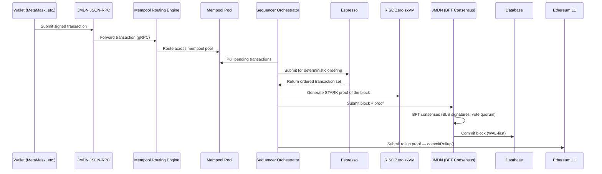

# Transaction & Block Lifecycle

> *The Truth Layer for Verifiable Information — every transaction on JMDT follows a deterministic, verifiable path from wallet to Ethereum finality.*

This page walks through the complete lifecycle of a transaction on the JMDT network, from the moment it's signed in a wallet to the moment its block is anchored on Ethereum L1.

---

## Overview

---

## Step 1 — Submission

A user submits a signed transaction from **MetaMask** or any EVM-compatible wallet to a JMDN node's **JSON-RPC endpoint**, using the standard `eth_sendRawTransaction` method. JMDN's RPC layer is fully Ethereum-compatible, so existing wallet integrations and dApp tooling work without modification.

JMDN supports both legacy and **EIP-1559 (Type 2)** transactions — see [EIP-1559 Support →](#eip-1559-support) below.

## Step 2 — Mempool Routing

The RPC layer forwards the transaction over gRPC to the **Mempool Routing Engine**, which distributes incoming transactions across a pool of independent mempools. This spreads load across the network and avoids any single mempool becoming a bottleneck or point of failure.

## Step 3 — Ordering via Espresso

The **Sequencer Orchestrator** pulls pending transactions from the mempool pool and submits them to **Espresso** for deterministic ordering. Espresso returns a single, agreed-upon ordering for the transaction set, which prevents ordering ambiguity and front-running before consensus even begins.

## Step 4 — Proof Generation

Once ordering is finalized, the Orchestrator generates a **zero-knowledge proof** of the block using the **RISC Zero zkVM** (a local, succinct STARK prover):

- Each transaction is hashed individually with **SHA-256**, using per-transaction boundary separators to prevent hash-boundary ambiguity between adjacent transactions.
- The block's overall commitment is a **Blake2b-256** digest computed over all transaction fields.
- The proof pipeline runs on **RISC Zero 3.0**.

See [Zero-Knowledge Proofs & RISC Zero zkVM →](/docs/zk) for the underlying proof system.

## Step 5 — BFT Consensus & Storage

The Orchestrator submits the ordered block and its proof to **JMDN**, which runs **BFT consensus**: validators sign with **BLS signatures**, and the block is finalized once it reaches vote quorum. On success, the block is stored to the database using a **write-ahead log (WAL)-first** strategy, ensuring the block record survives a crash before it's considered durable.

See [AVC Consensus Mechanism →](/docs/bft) for the full consensus protocol.

## Step 6 — L1 Finality

For Ethereum finality, the Orchestrator periodically selects committed blocks, generates a **RISC Zero STARK proof** of the block commitment, and calls **`commitRollup()`** on the **ZKRollup smart contract** deployed on Ethereum. The contract enforces:

- **Nonce ordering** — rollup commitments must be submitted in sequence
- **Double-commit protection** — a block commitment cannot be submitted to L1 more than once

Once `commitRollup()` succeeds, the block is anchored to Ethereum and inherits Ethereum's finality guarantees.

---

## EIP-1559 Support

JMDN supports **EIP-1559 Type 2 transactions** alongside legacy transaction types. Type 2 transactions include the following fields:

| Field | Description |
|---|---|
| `type` | Transaction type identifier (`2` for EIP-1559) |
| `max_fee` | Maximum total fee per gas the sender is willing to pay |
| `max_priority_fee` | Maximum tip per gas paid to the block producer |
| `gas_used` | Actual gas consumed by the transaction |

Wallets and tooling that already support EIP-1559 on Ethereum mainnet work against JMDN's RPC endpoint without any changes.

---

## Related

- [AVC Consensus Mechanism →](/docs/bft) — Consensus internals
- [Sequencer Module →](/docs/sequencer) — Ordering and proof orchestration
- [Zero-Knowledge Proofs & RISC Zero zkVM →](/docs/zk) — Proof generation details
- [JSON-RPC Reference →](/docs/gETH) — `eth_sendRawTransaction` and other RPC methods
