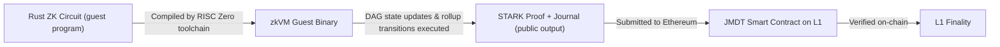

# Zero-Knowledge Proofs & RISC Zero zkVM

> **The Truth Layer for Verifiable Information.** JMDT uses Zero-Knowledge Proofs as the cryptographic backbone for privacy-preserving identity, private transactions, and verifiable state transitions — without exposing any underlying data.

Zero-Knowledge Proofs (ZKPs) allow one party to prove knowledge of certain information without revealing the information itself. In JMDT, ZKPs ensure **privacy and security while maintaining verifiability** across financial, identity, and enterprise applications.

---

## Two Types of ZK Proofs

JMDT supports both primary ZKP variants, leveraging the **RISC Zero zkVM** for unified execution:

### zk-SNARKs (Succinct Non-Interactive Argument of Knowledge)

- Provide **short, efficient proofs** with minimal computational overhead
- Widely used in privacy-preserving transactions and verifiable computations
- Require a **trusted setup** (managed securely within JMDT's protocol)
- Used for: transaction-level validation, DID authentication, L2 state checks

### zk-STARKs (Scalable Transparent Argument of Knowledge)

- Offer **enhanced scalability and transparency** with no trusted setup required
- Use hash-based cryptography — **quantum-resistant** and highly secure
- Particularly useful for large-scale computations in a trustless, decentralised manner
- Used for: L2 → L1 aggregation proofs, DAG state transition commitments, Ethereum finality

By integrating both SNARKs and STARKs, JMDT achieves a balance of **efficiency, security, and scalability** — eliminating trust dependencies while preserving computational performance.

---

## RISC Zero zkVM

JMDT employs a dual-layer ZK architecture, leveraging custom zk-circuits written in **Rust** and executed within the **RISC Zero Zero-Knowledge Virtual Machine (zkVM)** for high-assurance proofs.

### Why RISC Zero?

The RISC Zero zkVM acts as a **zk-powered virtual CPU** that proves the execution of arbitrary Rust code:

- No need to define manual R1CS or arithmetic circuits
- Enables fast iteration, modular upgrade paths, and readable cryptographic logic
- Guarantees integrity and reproducibility of enterprise workflows and DAG transitions
- Full **type safety and memory safety** via Rust; circuits are easy to audit and version-control

### Workflow

---

## Circuit Types

### 1. Transaction Validation Circuits (L2)

- Written in Rust as deterministic logic
- Validate balances, DID authentication, signature correctness, and state transitions within L2
- Output a **commitment hash** consumed by the zk-rollup aggregator

### 2. Aggregation & State Transition Circuits (L2 → L1)

- Aggregate multiple rollup blocks or DAG state transitions
- Execute recursive verification logic or Merkle root reconciliation
- Generate a succinct **STARK proof** using RISC Zero's zkVM for Ethereum submission

---

## ZK in Practice: Privacy-Preserving Queries

JMDT introduces a **DID-based querying mechanism** that enables privacy-preserving data access:

1. Users and enterprises can query blockchain data **without exposing sensitive details**
2. **Zero-Knowledge cryptography** prevents unauthorised access while allowing verifiable computations
3. **Federated and differential privacy techniques** ensure compliance with GDPR, HIPAA, and data sovereignty regulations
4. On-device ZK computation ensures personal data is verified without ever being shared

---

## Security Properties

| Property | Guarantee |
|---|---|
| **Completeness** | An honest prover can always convince the verifier |
| **Soundness** | A malicious prover cannot forge a valid proof |
| **Zero-Knowledge** | The verifier learns nothing beyond the truth of the statement |
| **Quantum Resistance** | zk-STARK proofs use hash-based cryptography — no elliptic curve assumptions |
| **Reproducibility** | RISC Zero zkVM ensures deterministic proof generation across all nodes |

---

## Integration Points

- **AVC Consensus** — Every block proposed by the Sequencer must include a valid zk-proof; all JMDN buddy nodes verify it independently. See [AVC Consensus →](/docs/bft)
- **DID Engine** — ZKPs authenticate user identity without exposing PII. See [Decentralised Identity →](/docs/did)
- **Sequencer & MemPool** — Aggregates DAG state and triggers zkVM proof generation. See [Sequencer →](/docs/sequencer)
- **L1 Commitment** — STARK proofs submitted to the JMDT Ethereum smart contract for on-chain verification
